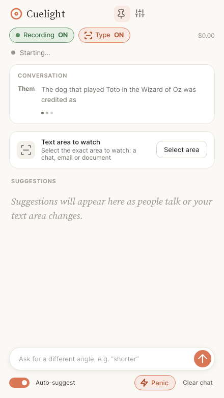
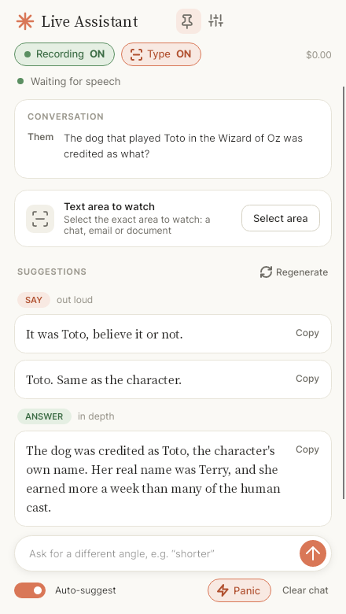

# Cuelight

> **Built with Claude Code.** A very large majority of this project (the code, the tests, the
> build setup and this documentation) was made with [Claude Code](https://claude.com/claude-code),
> Anthropic's AI coding tool. See the [disclaimer](#disclaimer) at the bottom: this is an independent
> project with no affiliation with Claude or Anthropic.

A small Windows app that listens to whatever your PC is playing, watches a box you draw
around any on-screen text, and uses an AI to tell you what to **say** and what to **type**,
in words that sound like a person. Bring your own API key for **Claude, ChatGPT, Gemini, Grok or
NVIDIA** (which has a **free** key), or for any other service that speaks the OpenAI chat API
(OpenRouter, Groq, a model running on your own PC with Ollama...).

[](https://github.com/CS92604/CueLight/actions/workflows/build.yml)
[](LICENSE)


[Get started](#get-started) · [Using it](#using-it) · [Settings](#settings) · [AI providers](#ai-providers) ·
[What it costs](#what-it-costs) · [Privacy](#privacy-and-responsible-use) ·
[If something doesn't work](#if-something-doesnt-work) · [Build from source](#build-from-source) ·
[Contributing](CONTRIBUTING.md)

<p align="center">
  
  
</p>

## Get started

1. Download `Cuelight.exe` from the latest [release](../../releases/latest) and
   double-click it. It is one file: nothing to unzip or install, not even .NET.
2. Choose your AI (Claude, ChatGPT, Gemini, Grok, NVIDIA or another service) and paste its API key. The
   welcome screen links to the page where each provider creates one. That's the only setup.
3. The first launch downloads a speech model (about 140 MB, once). The status line shows progress.

Windows may show a "protected your PC" prompt because the app isn't code-signed yet:
choose **More info**, then **Run anyway**. Each release lists the file's SHA-256, so you can check what you
downloaded (`Get-FileHash .\Cuelight.exe` in PowerShell).

**Runs on** 64-bit Windows 10 (1607 or later) and Windows 11 on Intel/AMD, with no installs:
the .exe carries the .NET runtime and the Visual C++ runtime inside it. (On first start it unpacks
the speech engine to `%LOCALAPPDATA%\Cuelight\runtime`, and .NET unpacks the graphics
libraries to a folder under `%TEMP%`; neither needs administrator rights.) PCs without AVX2 (older or
low-end processors) use a slower build of the speech engine automatically, and PCs with four or
fewer processor cores start on the fastest speech model. ARM PCs run it through Windows'
x64 emulation (not tried on one yet). Windows 7, 8 and 32-bit Windows aren't supported.

<p align="center"></p>

## Using it

Two switches sit at the top of the window.

- **Recording ON / OFF.** On, the app listens to what your speakers play (the other people on the
  call) and transcribes it on your PC. Off, it does nothing: the audio devices are released, the
  text area isn't watched, nothing is sent to the AI, and the buttons are disabled until you turn
  it back on. Whatever was already transcribed stays on screen.
- **Type ON / OFF.** Off (the default), the app only listens to the conversation and gives you
  things to **say**. Turn it on and a **Text area to watch** card appears with a **Select area**
  button: the screen freezes like the Snipping Tool and you drag a box over the chat, email or
  document. A thin blue outline stays around it (just outside, so it's never in what the AI
  sees). When the text changes and stops changing, the AI reads it and suggests what to **type**.
  Keep the Cuelight window off the box. Switching Type off stops watching but remembers the box.
- **Fast or Detailed** (Settings → Reading the text area) is how the text area reaches the AI.
  **Fast** reads the words in the area on your PC, with Windows' own text recognition, and sends only that
  text: no picture leaves your PC. **Detailed** sends an actual picture of the area to the provider each time it
  changes, so the AI sees the layout, colours, images and who wrote each message. See
  [Fast or Detailed?](#fast-or-detailed).

Then:

- The status line under the switches says **LISTENING** (the dot pulses) whenever someone is
  speaking, and **Waiting for speech** the rest of the time.
<p align="center">
  
  
</p>

- **Live words.** While someone is speaking, the **Conversation** box shows what they are saying as
  they say it (in grey, with three pulsing dots), and the finished transcript replaces it. The
  first words show after about a third of a second of speech and the line is refreshed several
  times a second, appearing word by word. Each refresh is a quick pass of the speech model over
  the speech so far (it looks at a smaller window than the final transcript does, which is what
  makes it fast), run whenever the model has nothing more important to do; a finished sentence
  always goes first. It uses some extra processor time while people talk; on a slow PC choose
  **Fast** under Speech recognition. Speech longer than 15 seconds without a pause is previewed
  with the full pass, which is slower.
- After someone finishes speaking you get up to a few options to **say**, each with a **Copy**
  button. If they asked you something, these answer it directly and briefly, in your voice.
- **ANSWER.** When the other person asks a question, sets a riddle or leaves a sentence hanging, a
  second, pink-labelled box gives a fuller answer to say in your own words or draw from: the
  answer first, then the explanation behind it. It is separate from the quick conversational reply,
  and it appears only when there is something to answer. The AI is told to say so inside the
  answer when it isn't sure of a fact, so check anything that matters.
- **Both at once:** with Type on, if someone is talking *and* the text area updates, you get a Say
  section and a Type section together, consistent with each other.
- **Panic** (shown when Type is on) forces the AI to read the text area *right now* and answer
  it: no waiting for a change, no settle delay, works even with Auto-suggest off. It also gives
  you something to say if the last thing spoken needs an answer. With no text area picked yet, it
  asks you to draw one first.
- **Regenerate** (above the suggestions) redoes the current reply. The AI is shown the replies
  you threw away and told to take a different angle, so you don't just get a reword. It uses your
  current settings, so change Tone or Length first if you want. Type a direction in the box
  first (“shorter”) and it becomes the new instruction.
- Type a direction in the box at the bottom (“shorter”, “ask about the timeline”) and press
  Enter for a fresh set. Turn **Auto-suggest** off to only get suggestions when you ask.
- The pin keeps the window on top.
- **Rest the mouse on any button, switch or option to see what it does.** In Settings every
  choice (each Professionalism, Proficiency, Tone, Length… option, each model, each speech
  accuracy) explains itself, and buttons that Recording-off disables say so.

### What the AI sees

Every request carries the **recent conversation** as text (up to about 30,000 characters, over half an
hour of talk; when a call runs longer, the oldest part is dropped in one go), but only the **current state** of
your text area: its words (Fast) or a picture of it (Detailed). Earlier pictures or read-out text are never kept or sent again, and the AI is told it only sees the
screen as it is now.

### Fast or Detailed?

When Type is on, the text area has to reach the AI somehow. Settings → **Reading the text area** chooses how:

| | **Fast** | **Detailed** (the default) |
|---|---|---|
| What reaches the AI | The words in the area, read on your PC with Windows' own text recognition | An actual picture of the area, sent each time it changes |
| What leaves your PC | Only text | A picture, with everything in it: names, avatars, anything else in the area |
| Cost | Less: roughly 150–400 tokens of text, against about 500 for a chat-sized picture | More, and a larger area costs more |
| Speed | Skips making and uploading a picture and the provider's picture processing, but first spends a moment reading the words on your PC. The saving is small and depends on your PC and provider, so try both. | Nothing to read first: the picture goes straight out |
| What the AI can tell | Only the words, top to bottom. It works out who wrote what from names and wording, can't see colours, alignment or images, and a misread word can slip in | Everything you see, so who wrote each message is clear even in a chat with bubbles on each side |
| Models | Any model, including ones that can't read pictures | Only models that can read pictures |
| Needs | A text-recognition language installed in Windows (usually already there). If it isn't, the app sends a picture instead and says so | Nothing extra |

Use **Fast** for plain text (an email, a document, a simple chat) when you want it cheaper, want nothing but words to
leave your PC, or are using a model that can't read pictures. Use **Detailed** when who said what depends on the layout, or
the area has images, tables or charts. A model that is known to be text-only (such as NVIDIA's Llama 3.3 70B) uses Fast
automatically.

With Fast, a request is only sent when the *words* in the area change: a blinking cursor or a new avatar changes the
picture but not the words, so nothing is sent. **Panic** and your own typed requests always send.

## Settings

| | |
|---|---|
| Professionalism | Very casual · Casual · Professional · Formal |
| Proficiency | How much jargon replies use and how deeply they explain things: **Simple** (plain words, explained from the ground up) · **Everyday** (a few common terms, briefly explained) · **Fluent** (normal professional vocabulary, shared background assumed) · **Advanced** (specialist jargon and depth, basics skipped). It never makes the AI claim expertise you haven't stated. |
| Tone | Warm · Neutral · Direct · Diplomatic · Confident |
| Length / options | Brief · Short · Detailed; 1–3 options per section |
| Reply language | Empty = match the other person |
| About me / extra instructions | Free text: who you are, words to avoid… |
| AI provider | Claude · ChatGPT · Gemini · Grok · NVIDIA (free) · Other (any OpenAI-compatible service). Each provider has its own saved key, so switching back needs nothing more. See [AI providers](#ai-providers). |
| Model | The models listed for the chosen provider (Claude: Sonnet 5.5 recommended and the default, Opus 5.5 for the best replies at twice the cost, Haiku 5.5 the cheapest). Every provider but Claude also takes any model name typed in, since models are replaced often. |
| Think before replying | Off by default, so a reply starts as soon as it can. On, the AI spends more effort on each reply: slower to start, better on hard or technical questions. |
| Reading the text area | **Fast** (the words in the area are read on your PC and only text is sent) or **Detailed** (a picture of the area is sent). Only matters when Type is on. See [Fast or Detailed?](#fast-or-detailed). Detailed by default. |
| Hide from screen sharing | Keeps every window of the app out of screen shares, recordings and screenshots. Windows 10 version 2004 or later. Off by default; see Privacy below. |
| Microphone | Also transcribe your own voice, so the AI knows what you've said. Use headphones. |
| Speech recognition | Fast · Balanced · Accurate (downloads a different model) |

Changes are saved as you make them and apply to the next suggestion.

## AI providers

| Provider | Get a key at | Models offered (default first) | Notes |
|---|---|---|---|
| **Claude** (Anthropic) | [console.anthropic.com](https://console.anthropic.com/settings/keys) | Sonnet 5.5, Opus 5.5, Haiku 5.5 | Called through Anthropic's own SDK, with its prompt cache. |
| **ChatGPT** (OpenAI) | [platform.openai.com](https://platform.openai.com/api-keys) | GPT-6.1 Sol, GPT-6 Astra, GPT-6 Luna | A ChatGPT subscription doesn't include API use; the key comes from the API platform. |
| **Gemini** (Google) | [aistudio.google.com](https://aistudio.google.com/apikey) | Gemini 3.8 Flash, Gemini 3.1 Pro (preview) | Called through Google's OpenAI-compatible address. |
| **Grok** (xAI) | [console.x.ai](https://console.x.ai) | Grok 4.7, Grok 4.3 | |
| **NVIDIA** | [build.nvidia.com](https://build.nvidia.com/settings/api-keys) | Llama 3.3 70B, Llama 3.2 11B Vision | **Free** (see below). Llama 3.3 70B can't read pictures, so it uses Fast screen reading automatically (or pick the Vision model for Detailed). |
| **Other** | wherever the service says | the model name you type | Any service with an OpenAI-style `/chat/completions` address, for example `https://openrouter.ai/api/v1`, `https://api.groq.com/openai/v1` or `http://localhost:11434/v1` (Ollama on this PC, which needs no key). |

Model names were current in October 2026. They change often, so Settings also takes any model name
you type; if a provider doesn't know it, the status line says so. For **Detailed** screen reading a model has to
**accept pictures**; **Fast** sends only text, so any model works (and the app switches to it by itself for a listed model that can't read pictures). The app asks for little or no thinking before a reply
(see [Speed](#speed)); if a provider refuses one of the optional settings it sends, the app sends the
request again without it and remembers that for the model.

### Free options

To try the app without paying:

- **NVIDIA** (built in): a free key with a free NVIDIA developer account, from
  [build.nvidia.com](https://build.nvidia.com/settings/api-keys). It is rate limited (about 40 requests a
  minute is the figure usually quoted; NVIDIA doesn't publish exact limits) and meant for trying things
  out, not for production. The cost counter says **Free**.
- **Gemini**: Google AI Studio keys have a free tier for the Flash models (not the Pro ones), with limits
  that Google sets and changes and that can be small, a daily request cap among them.
- **Other**: OpenRouter's models whose names end in `:free`, Groq's free plan, or a model running on your own
  PC with [Ollama](https://ollama.com), which needs no key and no internet.

Free tiers have limits, and the app asks for a suggestion after nearly every sentence, so a small cap can
run out quickly: turn **Auto-suggest** off to ask only when you press Send. Free services also differ in
what they do with what you send them (some use it to improve their models), so keep sensitive
conversations away from them and read their terms.

The Claude connection is the one that has been used with a real account. The others follow each
provider's published API and are tested against a local stand-in server, but not yet against the live
services, so if one misbehaves, what the provider replied is shown in the app and in the log.

<p align="center"></p>

## Look and feel

The interface has its own look: a white with a faint violet tint in light mode, a very dark purple in
dark mode, blue buttons and selections, and violet and pink touches on the **SAY**, **TYPE** and
**ANSWER** labels. The suggestions are set in a serif and the interface in a sans. It uses its own
name and icon, and open-source fonts rather than any of Anthropic's:
[Young Serif](https://github.com/noirblancrouge/YoungSerif) for the headings and suggestions and
[Inter](https://rsms.me/inter/) for the interface (both SIL Open Font License; Young Serif's
license text ships in `src/Cuelight.App/Assets/Fonts`). To change the fonts or the colours, edit
`src/Cuelight.App/Styles/Theme.axaml`: the two `FontFamily` entries, or the named colour brushes
(one set for light mode, one for dark).

## What it costs

AI providers bill API use **separately from a chat subscription** (a Claude Pro or ChatGPT Plus plan
doesn't include it). You add credit to the account the API key belongs to, at the provider's own
console, and most let you set a spending limit there. The exact amount you've spent is always in that
console.

The app is built to keep the cost low, and shows a running estimate in the top-right corner of its
window (rest the mouse on it for the number of requests and how much came from the cache). It uses the
providers' published prices for the models listed in Settings (NVIDIA's free API shows **Free**); for any
other model it counts tokens instead of dollars, and says the total is incomplete.

- **The default models are the middle ones**: Claude Sonnet 5.5 is half the price of Opus 5.5 and Haiku 5.5
  costs a twentieth of Sonnet; GPT-6.1 Sol, Gemini 3.8 Flash and Grok 4.7 are likewise each provider's
  balanced choice.
- **ChatGPT, Gemini and Grok** also remember a repeated start of a request on their own and bill it at a
  lower rate (each has its own rules), and the app lays its requests out the same way, the same
  conversation first and what changes last, so the saving applies to them too.
- **With Claude, it remembers what it has already read.** The instructions and the older conversation are sent
  in a form Claude can cache, so after the first request it re-reads them at a tenth of the usual price
  (a twentieth on Sonnet and Opus 5.5) and only pays full price for what's new. The conversation, the
  settings and the instructions come first, and the things that change every time (the screen picture,
  your direction) come after, so the cached part stays identical from one request to the next.
- **Only the recent conversation is sent**: up to about 30,000 characters (over half an hour of talk).
  When a call gets longer, the oldest part is dropped in one go, not a little each time, so the cache
  isn't broken by a start that keeps moving. A very long monologue keeps only its latest part.
- **Clear chat** when a new call starts, so it isn't paying to re-read the last one.

### Approximate cost per suggestion

A suggestion is one request to the AI, sent each time the other person pauses. These are estimates from the
providers' list prices and the size of the app's real requests. They haven't been compared with real bills yet,
so treat them as a guide, and trust the counter in the app and your provider's dashboard.

| Model | One suggestion (say only) | With an ANSWER box | Also reading the screen | One busy hour* |
|---|---|---|---|---|
| **Claude Sonnet 5.5** (default) | 0.16¢ | 0.33¢ | 0.34¢ | $0.33–0.67 |
| **Claude Opus 5.5** | 0.33¢ | 0.67¢ | 0.68¢ | $0.66–1.34 |
| **Claude Haiku 5.5** | 0.01¢ | 0.02¢ | 0.02¢ | $0.02–0.04 |
| **GPT-6.1 Sol** (default) | 0.16¢ | 0.33¢ | 0.33¢ | $0.31–0.65 |
| **GPT-6 Astra** | 0.93¢ | 1.78¢ | 1.82¢ | $1.87–3.57 |
| **GPT-6 Luna** | 0.01¢ | 0.02¢ | 0.02¢ | $0.02–0.04 |
| **Gemini 3.8 Flash** (default) | 0.55¢ | 0.68¢ | 0.69¢ | $1.11–1.36 |
| **Gemini 3.1 Pro** (preview) | 0.75¢ | 0.96¢ | 0.94¢ | $1.50–1.91 |
| **Grok 4.7** (default) | 0.25¢ | 0.35¢ | 0.40¢ | $0.50–0.71 |
| **Grok 4.3** | 0.11¢ | 0.16¢ | 0.20¢ | $0.23–0.31 |
| **NVIDIA** (Llama 3.3 70B, Llama 3.2 11B Vision) | free | free | free | free |
| **Other** | whatever that service charges; a model on your own PC costs nothing | | | |

\* An hour of a busy conversation is about 200 suggestions. The range runs from every one being say-only to every one
including an ANSWER box, which only appears when there is something to answer, so a real hour usually lands near the
low end. A cent is 0.01 dollars: 0.16¢ is about 6 suggestions for a cent.

How the figures were worked out:

- **The request.** The app's instructions are about 1,200 tokens, the style settings about 110, and the conversation so
  far is 10 minutes of talk (about 2,000 tokens). Token counts use the app's own estimate of four characters per token.
- **The cache.** The instructions and the older conversation are billed at the cached rate (Claude, ChatGPT and Grok),
  and only the newest few hundred tokens at the full rate. Gemini is counted with no cache discount, because Google's
  cached rate wasn't confirmed, so its figures are an upper bound and grow fastest as a call gets longer.
- **The reply.** With the default settings (short replies, two options each) a say-only reply is about 70 tokens, an
  ANSWER box adds about 170, and a reply for the text area adds about 70. A typical chat-sized text area is about 500
  tokens of picture, billed in full each time (a whole-screen area can be three times that). With **Fast** screen
  reading the same area is roughly 150–400 tokens of text, so the "Also reading the screen" column comes out a little
  lower; the saving is small next to the reply itself.
- **Longer calls cost more per suggestion** because more conversation is re-read each time: a third to a half more on Claude
  and ChatGPT once a call reaches the 30,000-character limit, and two to two and a half times on Gemini and Grok.
  Without the cache, a Claude Sonnet suggestion would cost roughly four times as much.
- **Thinking costs extra and isn't in these numbers.** A model that thinks before it answers bills that thinking as
  output. Claude Opus 5.5 and Grok 4.7 always do, and any model does with **Think before replying** on, so those can
  cost several times the figure above. Each 1,000 tokens of thinking adds the model's output price divided by 1,000
  (about 1¢ on Sonnet, 2¢ on Opus, 0.6¢ on Grok 4.7).
- **Gemini 3.8 Flash** is half this price until the end of 2026; the figure uses the standard price from 2027, so it
  isn't too low.

Turning **Auto-suggest** off (then it only answers when you press Send or Panic) or **Type** off (no screen
pictures) costs less still.

<details>
<summary>The prices used (US dollars per million tokens)</summary>

| Model | Model name | Input | Cached input | Output |
|---|---|---|---|---|
| Claude Opus 5.5 | `claude-opus-5-5` | $4 | $0.20 | $20 |
| Claude Sonnet 5.5 | `claude-sonnet-5-5` | $2 | $0.10 | $10 |
| Claude Haiku 5.5 | `claude-haiku-5-5` | $0.10 | $0.01 | $0.50 |
| GPT-6 Astra | `gpt-6-astra` | $10 | $1 | $50 |
| GPT-6.1 Sol | `gpt-6.1-sol` | $2 | $0.10 | $10 |
| GPT-6 Luna | `gpt-6-luna` | $0.10 | $0.01 | $0.50 |
| Gemini 3.1 Pro (preview) | `gemini-3.1-pro-preview` | $2 | $2* | $12 |
| Gemini 3.8 Flash | `gemini-3.8-flash` | $1.50 | $1.50* | $7.50 |
| Grok 4.7 | `grok-4.7` | $2 | $0.50 | $6 |
| Grok 4.3 | `grok-4.3` | $1.25 | $0.20 | $2.50 |

Claude also charges 1.25 times the input price to store something in its cache the first time (the other providers
don't charge for that). \* Google's cached rate wasn't confirmed, so cached tokens are counted at the full price.
These are the prices the app uses for its running total; they were read from each provider's pricing page in
October 2026 and do change.

</details>

## Speed

From the end of a sentence to the first words of a suggestion there are four waits: a pause of about
0.7 seconds that tells the app the sentence is over, transcribing it on your PC, a short 0.4-second
merge window, and the AI's own time to start answering. To keep the last one short, Claude Sonnet and
Haiku reply without thinking first and the other providers are asked for low reasoning effort (Settings →
**Think before replying** gives the AI more room to think), and the smaller models are the quickest; models
that always reason, like Claude Opus 5.5 and Grok 4.7, start a little slower. If transcribing is the
slow part on your PC, choose **Fast** under Speech recognition. For the text area, **Fast** reading under
[Reading the text area](#fast-or-detailed) swaps making and uploading a picture for reading its words on your PC; the
difference is small and varies, so it is worth trying both.

## Privacy and responsible use

- Your API keys are stored encrypted for your Windows account (DPAPI), one per provider, and each is only
  ever sent to the provider it belongs to (or, for "Other", the address you entered).
- The app connects to two things only: the AI provider you chose, and huggingface.co, once, to download the
  speech model. It has no analytics, crash reporting or update check, and sends nothing to the author.
- A plain `http://` address for "Other" is refused unless it points at this PC or your own network (an Ollama
  on another machine at home is fine), so a key and a conversation can't be sent across the internet unencrypted.
- Speech is turned into text **on your PC**. The provider you chose receives the transcript text and, only
  if you've turned Type on and picked a text area, either the words read from it on your PC (**Fast**) or a picture
  of it (**Detailed**), as you choose in Settings. Each provider has its own terms for what it does
  with what it receives; read them if that matters for what you discuss.
- Auto-suggest sends a request after nearly every sentence you hear, and API use costs money.
  See **What it costs** above.
- Transcription and screen reading make mistakes, and the AI is told never to invent facts or
  experiences about you. Check anything factual before you say or send it.
- Recording or transcribing other people can require their consent where you live, and many
  employers, schools and interviewers prohibit live AI help. Check the rules for your
  situation.
- **Hide from screen sharing** (Settings → Privacy, off by default) uses the Windows setting that
  apps like password managers use, so Teams, Zoom, Meet, OBS, the Snipping Tool and similar
  capture software don't see the app's windows, including the picker and the blue outline.
  It doesn't hide anything from a camera pointed at your screen, a capture card, or anyone
  looking at your monitor, and the app's taskbar button can still show up if your whole screen
  is shared. It's for keeping your notes and other people's messages private, not for getting
  around someone who has asked you not to use AI help. It also means your own screenshots of the
  app come out blank.

## If something doesn't work

- **Log.** Problems are written to `%LOCALAPPDATA%\Cuelight\logs\app.log`: errors
  and facts about the PC, never what was said, what was on screen, or your key.
- **Check this PC.** `Cuelight.exe --self-test --out C:\temp\check` tests the speech
  engine (with real speech if you pass `--wav file.wav --expect word`), the sound devices, screen
  capture, drawing the windows and hiding them from capture, and writes `self-test.txt` and
  screenshots there. Add `--noavx` to test the build for CPUs without AVX2. The Windows build
  runs exactly this on every push.
- **Blank or missing window.** If a start doesn't finish, the next one draws with the CPU
  instead of the graphics card (delete `software-rendering.flag` in the data folder to undo).
  `--software-rendering` forces it.
- **Speech model won't download** (blocked network): the status line says so and offers Retry.
  Downloads resume where they stopped. To do it by hand, put `ggml-base.en.bin` (or `-tiny.en` /
  `-small.en`) from [huggingface.co/ggerganov/whisper.cpp](https://huggingface.co/ggerganov/whisper.cpp)
  in `%LOCALAPPDATA%\Cuelight\models`.
- **Sound.** The app follows your default speakers and headphones when you switch, retries after
  an unplug or sleep, and says in the status line when no device is available or Windows is
  blocking the microphone (Settings → Privacy & security → Microphone).
- **Lock screen / UAC prompts.** Watching the text area pauses itself and carries on when the
  screen is back.
- **A provider says no.** The status line shows what it said, in plain words: a key it doesn't accept, a model
  name it doesn't know (pick another in Settings), no credit left, or a model that can't read pictures (pick
  another, or turn Type off).
- **"Windows has no text recognition installed."** Fast screen reading uses Windows' own text recognition, which comes
  with a language's optional features. In Windows Settings → Time & language → Language & region, open your language's
  options and make sure **Optical character recognition** is installed (or add English). Until then the app sends a
  picture of the text area instead.
- **Behind a work proxy.** The app uses your Windows proxy settings and sign-in. Your AI provider and
  Hugging Face (first-run speech download) must be reachable.
- **Still stuck?** [Open an issue](../../issues/new/choose). The form asks for your Windows version, the AI
  provider and the end of the log. Remove any API key before pasting anything. For a security problem, see
  [SECURITY.md](SECURITY.md) instead.

## Build from source

Needs the [.NET 8 SDK](https://dotnet.microsoft.com/download).

```bash
dotnet test                                   # unit + headless UI tests (any OS)
dotnet run --project src/Cuelight.App        # run it (listening and text-area watching need Windows)
dotnet publish src/Cuelight.App -c Release -r win-x64 -o publish   # -> publish/Cuelight.exe, one file
```

The app targets Windows 10's APIs (for the text recognition), so on Linux or macOS the first build downloads
a small Windows targeting pack from NuGet by itself; nothing else changes.

Avalonia's build tooling sends anonymous build-time usage data when you compile; set the environment
variable `AVALONIA_TELEMETRY_OPTOUT=1` to turn that off (the built app itself sends nothing). See
[CONTRIBUTING.md](CONTRIBUTING.md) before opening a pull request.

The **Build** GitHub Actions workflow runs the tests (on Linux and on Windows), builds the
single `.exe`, fails if the publish folder holds anything else, copies the `.exe` alone into an empty
folder and runs the self-test above from there on a real Windows machine, checks that nothing it
unpacked needs a DLL a clean Windows PC lacks (`packaging/check-deps.py`), and uploads the result.
Pushing a tag like `v0.2.0` (or running the workflow by hand with a tag) also publishes it as a
[release](../../releases) whose only file is `Cuelight.exe` (its SHA-256 is in the notes).

## How it's put together

| | |
|---|---|
| `src/Cuelight.Core` | Everything that isn't UI or OS: conversation, prompting, SAY/TYPE parsing, the suggestion engine, change detection, speech segmentation, settings, key storage, the Claude client (official Anthropic .NET SDK) and a client for the OpenAI-style chat API used by ChatGPT, Gemini, Grok and others. |
| `src/Cuelight.App` | Avalonia UI (light/dark, violet-and-blue theme), Windows audio (WASAPI loopback + mic via NAudio), GDI screen capture, Windows text recognition for Fast screen reading (Windows.Media.Ocr), Whisper speech recognition (Whisper.net / whisper.cpp). |
| `tests/` | 345 core tests (including the real SDK against a local fake server) and 126 app tests: headless UI tests that render the windows, drive the area picker with simulated input, check every control has hover text, and measure the layout (equal gaps left and right, nothing running off the edge at the smallest window size, at 100–250% display scaling), plus the model downloader, speech-engine unpacking, single-instance and start-up logic. |

## License

[MIT](LICENSE): you may use, copy, modify and share it freely, as long as the license notice stays with it.
The fonts bundled with the app and the libraries it uses keep their own licenses: see
[THIRD-PARTY-NOTICES.md](THIRD-PARTY-NOTICES.md) (the fonts' license text is also in
`src/Cuelight.App/Assets/Fonts`).

## Credits

Built on [Avalonia](https://avaloniaui.net/) (the interface), [NAudio](https://github.com/naudio/NAudio)
(Windows audio), [Whisper.net](https://github.com/sandrohanea/whisper.net) and
[whisper.cpp](https://github.com/ggerganov/whisper.cpp) with OpenAI's Whisper speech models
(speech recognition, on your PC), the [Anthropic .NET SDK](https://github.com/anthropics/anthropic-sdk-csharp)
(Claude), and the fonts above. The other providers are reached over plain HTTPS with the standard .NET
libraries. Each component is under its own open-source license.

## Disclaimer

Cuelight is an independent, unofficial project. It is **not affiliated with, endorsed by, sponsored by
or connected to Anthropic, PBC**, the maker of Claude, **or to OpenAI, Google, xAI or NVIDIA**. "Claude" and
"Claude Code" are trademarks of Anthropic; "ChatGPT" and "GPT" of OpenAI; "Gemini" of Google; "Grok" of
xAI; "NVIDIA" of NVIDIA Corporation; the names of the other companies and models mentioned belong to their
owners. They appear here only to say what the app works with and (Claude Code) how it was made. The app
contains no logos, fonts or other assets from any of them. You use it with your own API key for the
provider you choose, and that provider bills the use to you under its own terms.
