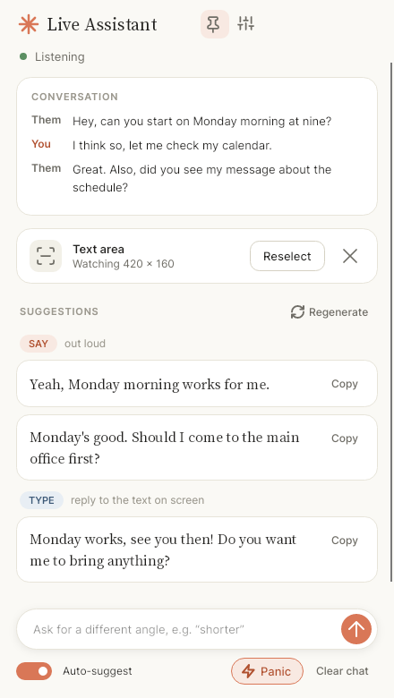
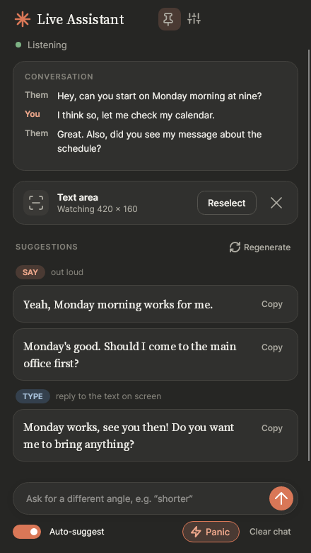
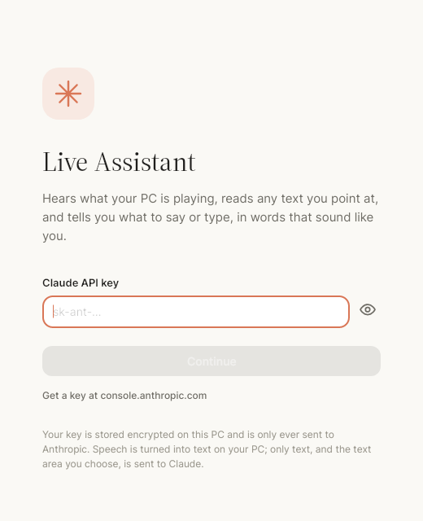
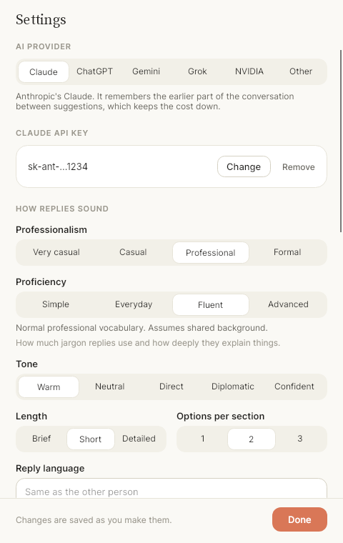

# Claude Live Conversation Assistant

A small Windows app that listens to whatever your PC is playing, watches a box you draw
around any on-screen text, and uses Claude to tell you what to **say** and what to **type**,
in words that sound like a person.

<p align="center">
  
  
</p>

## Get started

1. Download `ClaudeLiveAssistant-win-x64.zip` from the latest [release](../../releases/latest),
   unzip it, and run `ClaudeLiveAssistant.exe`. Nothing to install, not even .NET.
2. Paste your Claude API key ([get one here](https://console.anthropic.com/settings/keys)).
   That's the only setup.
3. The first launch downloads a speech model (about 140 MB, once). The status line shows progress.

Windows may show a "protected your PC" prompt because the app isn't code-signed yet:
choose **More info → Run anyway**.

<p align="center"></p>

## Using it

- **It always listens** to what your speakers play (the other people on the call) and
  transcribes it on your PC. After someone finishes speaking you get up to a few options to
  **say**, each with a **Copy** button.
- **Select** a text area to watch a chat window, email or document: the screen freezes like
  the Snipping Tool and you drag a box over the text. A thin orange outline stays around it
  (just outside, so it's never in what Claude sees). When the text changes and stops
  changing, Claude reads it and suggests what to **type**. Keep the assistant window off the box.
- **Both at once:** if someone is talking *and* the text area updates, you get a Say section
  and a Type section together, consistent with each other.
- **Panic** forces Claude to read the text area *right now* and answer it: no waiting for a
  change, no settle delay, works even with Auto-suggest off. It also gives you something to say
  if the last thing spoken needs an answer. With no text area picked yet, it asks you to draw
  one first.
- **Regenerate** (above the suggestions) redoes the current reply. Claude is shown the replies
  you threw away and told to take a different angle, so you don't just get a reword. It uses your
  current settings, so change Tone or Length first if you want. Type a direction in the box
  first (“shorter”) and it becomes the new instruction.
- Type a direction in the box at the bottom (“shorter”, “ask about the timeline”) and press
  Enter for a fresh set. Turn **Auto-suggest** off to only get suggestions when you ask.
- The pin keeps the window on top.

### What Claude sees

Every request carries the **whole conversation so far** as text (about two hours of speech
before the oldest turns start dropping off), but only the **current picture** of your text
area. Earlier pictures are never kept or sent again, and Claude is told it only sees the
screen as it is now.

## Settings

| | |
|---|---|
| Professionalism | Very casual · Casual · Professional · Formal |
| Proficiency | How much jargon replies use and how deeply they explain things: **Simple** (plain words, explained from the ground up) · **Everyday** (a few common terms, briefly explained) · **Fluent** (normal professional vocabulary, shared background assumed) · **Advanced** (specialist jargon and depth, basics skipped). It never makes Claude claim expertise you haven't stated. |
| Tone | Warm · Neutral · Direct · Diplomatic · Confident |
| Length / options | Brief · Short · Detailed; 1–3 options per section |
| Reply language | Empty = match the other person |
| About me / extra instructions | Free text: who you are, words to avoid… |
| Claude model | Opus 5.5 (best replies) · Sonnet 5.5 (faster, cheaper) · Haiku 4.5 (fastest) |
| Microphone | Also transcribe your own voice, so Claude knows what you've said. Use headphones. |
| Speech recognition | Fast · Balanced · Accurate (downloads a different model) |

Changes are saved as you make them and apply to the next suggestion.

<p align="center"></p>

## Look and feel

The interface follows Claude's own: warm off-white (or charcoal in dark mode), a clay-orange
accent, Claude's words (the suggestions) set in a serif and the interface in a sans.
Claude's own typefaces are proprietary, so the app bundles open stand-ins:
[Source Serif 4](https://github.com/adobe-fonts/source-serif) for the serif and
[Inter](https://rsms.me/inter/) for the sans (both SIL Open Font License; the license text
ships in `src/Assistant.App/Assets/Fonts`). To use different fonts, change the two
`FontFamily` entries at the top of `src/Assistant.App/Styles/Theme.axaml`.

## Privacy and responsible use

- Your API key is stored encrypted for your Windows account (DPAPI) and only ever sent to Anthropic.
- Speech is turned into text **on your PC**. Claude receives the transcript text and, only
  if you've selected one, a picture of that text area.
- Auto-suggest sends one request per spoken turn or text change, and each one carries the
  conversation so far, so a long call costs more per suggestion as it goes. Sonnet, Haiku, or
  turning Auto-suggest off costs less. I haven't measured real costs.
- Transcription and screen reading make mistakes, and Claude is told never to invent facts or
  experiences about you. Check anything factual before you say or send it.
- Recording or transcribing other people can require their consent where you live, and many
  employers, schools and interviewers prohibit live AI help. Check the rules for your
  situation. The window doesn't hide itself from screen sharing.

## Build from source

Needs the [.NET 8 SDK](https://dotnet.microsoft.com/download).

```bash
dotnet test                                   # unit + headless UI tests (any OS)
dotnet run --project src/Assistant.App        # run it (listening and text-area watching need Windows)
dotnet publish src/Assistant.App -c Release -r win-x64 --self-contained -o publish
```

The **Build** GitHub Actions workflow runs the tests and builds the Windows zip on every push.
Pushing a tag like `v0.2.0` (or running the workflow by hand with a tag) also publishes it as a
[release](../../releases) with the zip and a SHA-256 file attached.

## How it's put together

| | |
|---|---|
| `src/Assistant.Core` | Everything that isn't UI or OS: conversation, prompting, SAY/TYPE parsing, the suggestion engine, change detection, speech segmentation, settings, key storage, Claude client (official Anthropic .NET SDK). |
| `src/Assistant.App` | Avalonia UI (light/dark, Claude-style theme), Windows audio (WASAPI loopback + mic via NAudio), GDI screen capture, Whisper speech recognition (Whisper.net / whisper.cpp). |
| `tests/` | 95 core tests (including the real SDK against a local fake server) and 17 headless UI tests that render the windows and drive the area picker with simulated input. |
